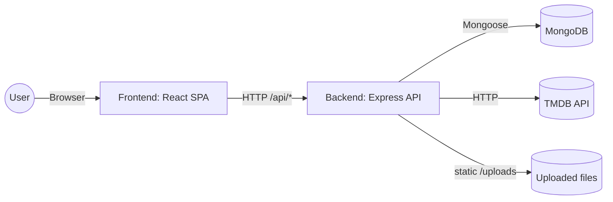

# Architecture

Last updated: 2026-03-16

## High-Level Overview

Showme is a single-page web application for browsing and rating movies/TV.

- Frontend: React (Vite) SPA served from `packages/frontend`
- Backend: Node.js + Express REST API in `packages/backend`
- Database: MongoDB (via Mongoose)
- External API: The Movie Database (TMDB), used for media discovery/details

## Monorepo Structure

- `packages/frontend`: UI, client-side routing, and API client modules
- `packages/backend`: REST API, authentication, persistence, and TMDB integration
- `packages/express-backend`: present but empty/unconfigured (not used by current scripts)

The root `package.json` uses npm workspaces and a `dev` script that starts both the backend and frontend together.

## Frontend (packages/frontend)

Entry points

- `packages/frontend/src/main.jsx`: mounts the app and `BrowserRouter`
- `packages/frontend/src/App.jsx`: route table and top-level providers

Key modules

- Pages live in `packages/frontend/src/pages` and are wired via `react-router-dom`
- UI components live in `packages/frontend/src/components`
- API client wrappers live in `packages/frontend/src/api`
  - `tmdb.js` talks to backend `/api/tmdb/*`
  - `ratings.js` talks to backend `/api/ratings/*` and `/api/films/*`
- Auth state lives in `packages/frontend/src/context/AuthContext.jsx`
  - stores JWT in `localStorage`
  - sends `Authorization: Bearer <token>` for protected endpoints

Backend URL configuration

- `VITE_API_URL` can point the frontend at a deployed backend (e.g., `https://...`)
- In dev, `packages/frontend/vite.config.js` proxies `/api` to `VITE_API_URL` (default `http://localhost:3001`)
  - this enables frontend code to use relative `/api/...` requests without CORS during local dev

## Backend (packages/backend)

Entry points

- `packages/backend/src/server.js`: connects to MongoDB and starts the HTTP server
- `packages/backend/src/app.js`: Express app wiring (middleware, routes, error handling)

HTTP surface area

- `GET /health`: liveness endpoint
- `POST /signup`, `POST /login`: username/password auth returning a JWT
- `GET /uploads/*`: static serving for uploaded profile pictures (see `packages/backend/src/routes/users.js`)
- `GET /api/tmdb/*`: TMDB proxy/aggregation routes
- `GET/PUT/DELETE /api/ratings/*`: rating CRUD + aggregates
- `GET /api/films/*`: lists films in the DB; lookup by TMDB id
- `GET/PUT /api/users/*`: basic profile read/update + profile picture upload

Implementation layers

- Routes: `packages/backend/src/routes/*`
- Controllers: `packages/backend/src/controllers/*`
  - request validation uses `zod`
  - controllers are wrapped with `asyncHandler` for consistent error propagation
- Services: `packages/backend/src/services/*`
  - `tmdbClient.js`: Axios wrapper to TMDB with standardized errors
  - `ratingService.js`: DB operations + aggregates (e.g., recompute `Film.avgRating`)
- Models: `packages/backend/src/models/*` (Mongoose schemas)
- Middleware: `packages/backend/src/middleware/*`
  - `errorHandler.js` standardizes error responses (including Zod validation errors)
  - `notFound.js` handles unknown routes
- Config: `packages/backend/src/config/*`
  - `env.js` validates environment variables at startup
  - `db.js` connects/disconnects from MongoDB

## Data Flows (Examples)

Search and browse media (TMDB-backed)

1. UI calls `packages/frontend/src/api/tmdb.js` (e.g., `searchFilms`)
2. Frontend requests backend `GET /api/tmdb/search?...`
3. Backend controller (`tmdb.controller.js`) calls TMDB via `services/tmdbClient.js`
4. Backend normalizes the payload and returns JSON to the UI

Rate a film (MongoDB-backed)

1. UI fetches details via `GET /api/tmdb/:type/:tmdbId`
  - backend persists/updates a `Film` document while serving details
2. UI looks up the persisted `Film` id via `GET /api/films/lookup?tmdbId=...&type=...`
3. Authenticated UI submits a rating via `PUT /api/ratings/:filmId` with a JWT
4. Backend upserts a `Rating` and recalculates `Film.avgRating` and `Film.ratingCount`

## Runtime Configuration

Backend env vars are defined/validated in `packages/backend/src/config/env.js` and example values live in `packages/backend/.env.example`.

Common variables

- `PORT`: backend HTTP port (example uses `3001`)
- `MONGODB_URI`: MongoDB connection string
- `TMDB_API_KEY`: API key used by TMDB requests
- `JWT_SECRET`: signing secret for auth tokens
- `CORS_ORIGIN`, `CLIENT_ORIGIN`: origins used for CORS and static upload access

## Local Development Notes

- Start both packages from the repo root: `npm run dev`
- MongoDB can be run locally or via Docker using `packages/backend/docker-compose.yml`

