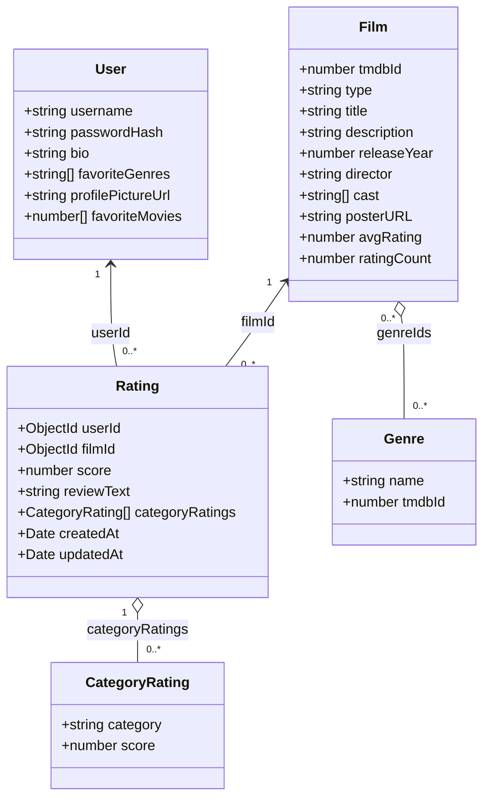

# UML Class Diagram

Last updated: 2026-03-16

This diagram documents the backend domain model as implemented in `packages/backend/src/models/*`.

- Diagram source (checked in): `docs/uml/class-diagram.mmd`
- Reference (team board): the existing Figma board linked from the root `README.md`

Notes

- `Rating.categoryRatings` is modeled as a Mongoose subdocument array (not a top-level collection).
- `Film.genreIds` is an array of `Genre` references, representing a many-to-many relationship.

